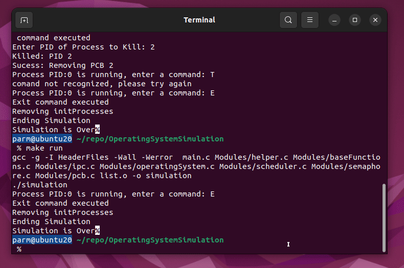
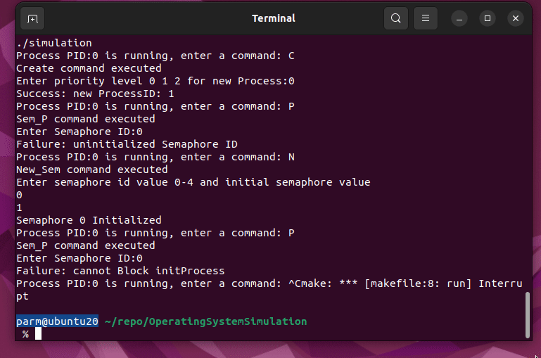

# Project Title

## Overview

This project simulates an operating system kernel that manages processes using a multilevel priority queue and runs them in a simulated single core CPU.

## Components

The main components of the program are:

- `OperatingSystem`: This structure represents the kernel of the operating system.
- `ProcessControlBlock`: This structure represents a process in the operating system.

## Execution

The program runs in a loop until the initial process is terminated. During each iteration of the loop, it accepts a user command and performs an action based on that command.

## User Commands

- `C` : prompts for a priority level then creates and assigns a Process Control Block data structure, which represents processes, to the appropriate ready 
queue 
- `Q`: Runs one iteration of the CPU. It selects a process from the priority queue and runs it for a quantum of time. 

- `I` : prompts the user for a process Id then displays the attributes of the process on the terminal

- `T`: displays all the processes in the system

- `E`: destroys the currently running process and schedules the next running process to run, if the currently running process is initProcess the program is ended however this is only possible if there are no other processes on the queues.

- `K`: Terminates the process of the indicated Process ID (PID). If the killed process was the initial process, and there are no other processes the program ends. it is assumed that users dont kill processes that are Blocked or waiting on Senders or receivers.

- Any other character: The program does nothing.
 

## Inter Process Communication

- `S` : Given a PID Value for a receiving process sends a message then places the sending process on a waiting for Reply event queue.

- `R` : Check to see if the running process is supposed to receive a message then prints the message to the screen .

- `Y` : sends a message to a sender to acknowledge that a message has been received

## Semaphores P and V atomic operations

- `N` : initializes a semaphore value in the kernal.

- `P` : on a given Semaphore blocks a process if below the semaphore threshold and decriments the semaphore value.

- `V` : on a given Semaphore value unblocks a process and incriments the value of a semaphore.

## Style Conventions

- Variables are in camelCase (e.g., `pKernal`)
- Structs are in PascalCase (e.g., `ProcessControlBlock`)
- Functions are in snake_case with the module name as a prefix (e.g., `operatingSystem_Constructor`)

## Assumptions

A process can only have 1 sender waiting at a time
init process cant call send/receive/reply (if init process is running wont be anyone to receive/reply to anyways)

Killing a process that is blocked or waiting is a user error

 